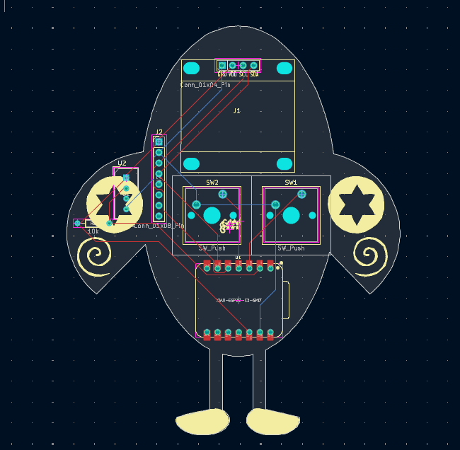
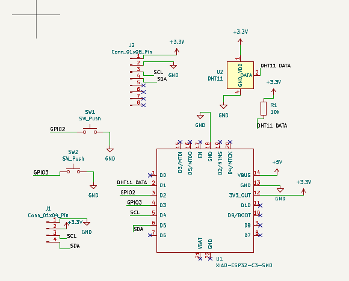

# Starbie

This is a Starbie project that I made following the Starbie toturial. I customised it by making the PCB chicken shaped and adding different designs features to it. I also edited and added my own bitmap art.

## PCB Design and Layout

My pcb board design and layout: . 
I made it chicken shaped and added patterns to it to customise it.

## Schematics

My schematics: . 
Created following the Starbie tutorial.

## Firmware

For the firmware I added a custom bitmap that has the beak and eyes for my chicken. I also renamed the menu items to my own ones.